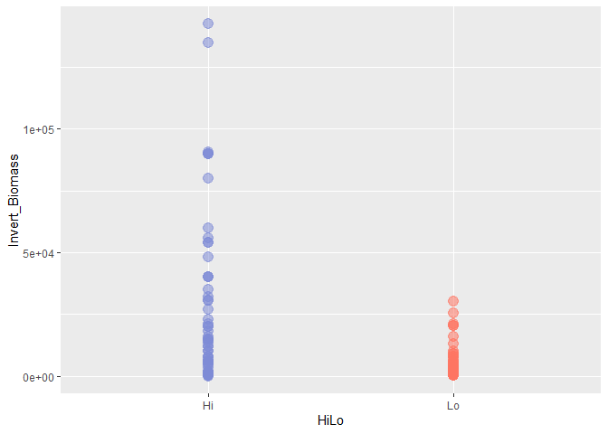
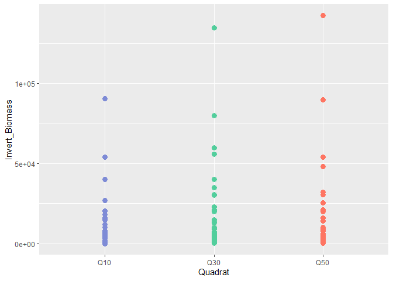
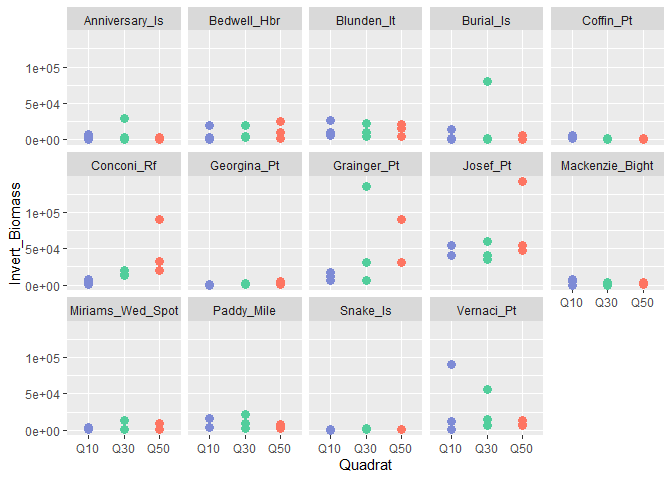
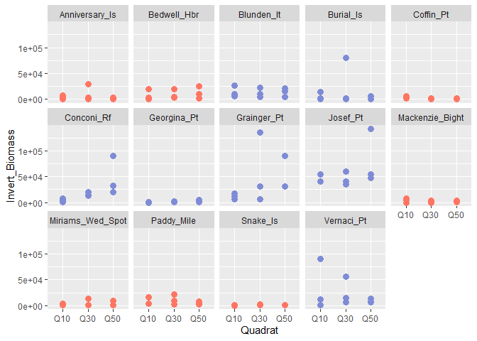

HiLo Exploratory Analysis
================
Fiona Francis
2/8/2021

This analysis is for Sharon Jeffrey and is part of an overall project
looking at the effect of curret speed on fish and invertebrate
communities at different sites in the Straight of Georgia. Jillian
Campbell’s MSc analysis was also a component of this project.

Sharon is interested in using a mixed-effects model to look at how
different factors including site current speed, depth and substrate type
affect invert biomass and invert % cover.

The study uses 14 sites, 7 “high” current sites and 7 “low” current
sites. At each site Sharon collected invert data in 9 quadrats that are
seperated into 3 depths (10, 30 and 50 ft depth). There is no repeat
sampling so there are a total of 126 data points (14sites\*9quadrats).
However, because there are multiple collections at each site, a mized
effects model is necessary to account for replciation at the site level.
I don’t think that we need to nest transect within site because I think
that each transect was at 1 depth (need to confirm this with Sharon) and
so depth is already being included as a fixed effect and accounting for
this replication (We need to worry about transect if they were run
perpendicular to shore (i.e. from 10 to 50 m)).

## Loading Data

## Data visualization

<!-- --><!-- --><!-- --><!-- -->

Note that the `echo = FALSE` parameter was added to the code chunk to
prevent printing of the R code that generated the plot.
