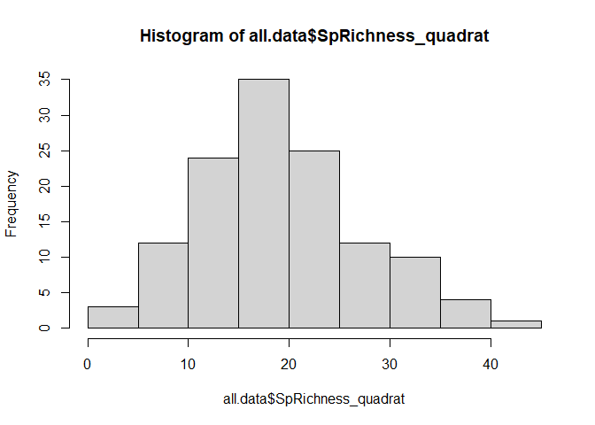
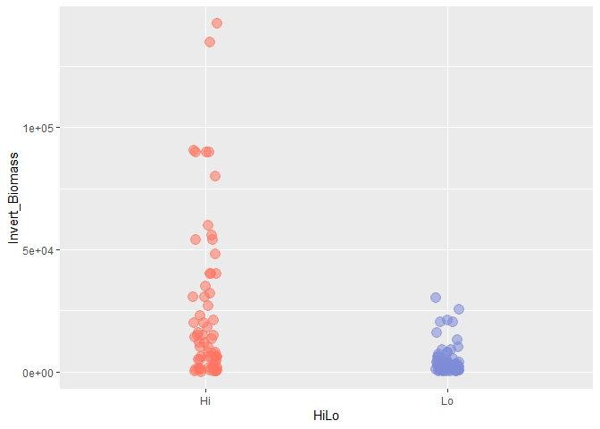
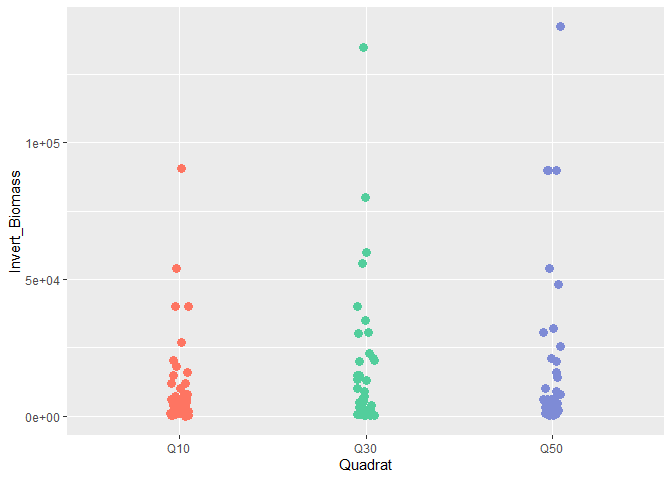
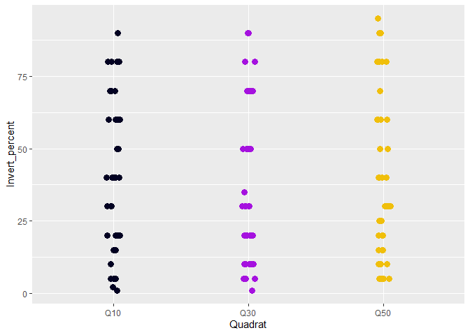

HiLo Exploratory Analysis
================
Fiona Francis
2/8/2021

This analysis is for Sharon Jeffrey and is part of an overall project
looking at the effect of curret speed on fish and invertebrate
communities at different sites in the Straight of Georgia. Jillian
Campbell’s MSc analysis was also a component of this project.

Sharon is interested in using a mixed-effects model to look at how
different factors including site current speed, depth and substrate type
affect invert biomass and invert % cover.

The study uses 14 sites, 7 “high” current sites and 7 “low” current
sites. At each site Sharon collected invert data in 9 quadrats that are
seperated into 3 depths (10, 30 and 50 ft depth). There is no repeat
sampling so there are a total of 126 data points (14sites\*9quadrats).
However, because there are multiple collections at each site, a mixed
effects model is necessary to account for replciation at the site level.
I don’t think that we need to nest transect within site because I think
that each transect was at 1 depth (need to confirm this with Sharon) and
so depth is already being included as a fixed effect and accounting for
this replication (We need to worry about transect if they were run
perpendicular to shore (i.e. from 10 to 50 m)).

## Loading Data

## Data visualization

Hi vs Lo

<!-- -->

Hi vs Lo (Log10 Biomass)

<!-- -->

Biomass at each quad depth overall

<!-- -->

Biomass at quad depth by site

<!-- -->

Biomass at quad depth by site coloured by Hi Lo

<!-- -->

## Same plots but looking at % invert cover instead of biomass

<!-- --><!-- --><!-- --><!-- -->

## Plots of biomass vs current speed

Biomass vs current speed coloured by hi lo

<!-- -->

Log10Biomass vs current speed coloured by hi lo

<!-- -->

Biomass vs current speed coloured by quadrat

<!-- -->

Biomass vs rock cover

<!-- -->

Biomass vs Slope

<!-- -->

## mixed-effect models

``` r
head(all.data)
```

    ## # A tibble: 6 x 24
    ##   Date  Site  HiLo  Transect Quadrat QuadName Diver_invert Diver_algae
    ##   <chr> <chr> <chr> <chr>    <chr>   <chr>    <chr>        <chr>      
    ## 1 26-J~ Buri~ Hi    T1       Q10     Burial_~ sharon       candice    
    ## 2 26-J~ Buri~ Hi    T1       Q30     Burial_~ sharon       candice    
    ## 3 26-J~ Buri~ Hi    T1       Q50     Burial_~ sharon       candice    
    ## 4 26-J~ Buri~ Hi    T2       Q30     Burial_~ candice      sharon     
    ## 5 26-J~ Buri~ Hi    T2       Q50     Burial_~ candice      sharon     
    ## 6 27-J~ Buri~ Hi    T2       Q10     Burial_~ candice      sharon     
    ## # ... with 16 more variables: Invert_percent <dbl>, Invert_Biomass <dbl>,
    ## #   DominantSp_1 <chr>, DominantSp_2 <chr>, substrate_1 <dbl>,
    ## #   substrate_1cov <dbl>, substrate2 <dbl>, substrate2cov <dbl>,
    ## #   substrate3 <dbl>, substrate3cov <dbl>, Comments <chr>, site_length_m <dbl>,
    ## #   SlopeAngle <dbl>, AvgDailMaxCurr <dbl>, InvertSpRichness <dbl>,
    ## #   AvgRkCov <dbl>

``` r
glimpse(all.data)
```

    ## Rows: 126
    ## Columns: 24
    ## $ Date             <chr> "26-Jun", "26-Jun", "26-Jun", "26-Jun", "26-Jun", ...
    ## $ Site             <chr> "Burial_Is", "Burial_Is", "Burial_Is", "Burial_Is"...
    ## $ HiLo             <chr> "Hi", "Hi", "Hi", "Hi", "Hi", "Hi", "Hi", "Hi", "H...
    ## $ Transect         <chr> "T1", "T1", "T1", "T2", "T2", "T2", "T3", "T3", "T...
    ## $ Quadrat          <chr> "Q10", "Q30", "Q50", "Q30", "Q50", "Q10", "Q10", "...
    ## $ QuadName         <chr> "Burial_Is_T1Q10", "Burial_Is_T1Q30", "Burial_Is_T...
    ## $ Diver_invert     <chr> "sharon", "sharon", "sharon", "candice", "candice"...
    ## $ Diver_algae      <chr> "candice", "candice", "candice", "sharon", "sharon...
    ## $ Invert_percent   <dbl> 30, 80, 30, 10, 60, 30, 15, 30, 60, 90, 90, 60, 80...
    ## $ Invert_Biomass   <dbl> 15000, 80000, 6000, 300, 1200, 1800, 150, 1500, 60...
    ## $ DominantSp_1     <chr> NA, "Metridium farcimen", NA, NA, NA, NA, NA, NA, ...
    ## $ DominantSp_2     <chr> NA, "Dodecaceria fewksi", NA, NA, NA, NA, NA, NA, ...
    ## $ substrate_1      <dbl> 2, 1, 5, 2, 2, 2, 2, 2, 2, 3, 1, 3, 3, 1, 1, 1, 2,...
    ## $ substrate_1cov   <dbl> 80, 50, 70, 100, 100, 100, 100, 100, 100, 90, 80, ...
    ## $ substrate2       <dbl> 10, 2, 4, NA, NA, NA, NA, NA, NA, 10, 10, 10, 10, ...
    ## $ substrate2cov    <dbl> 20, 50, 20, NA, NA, NA, NA, NA, NA, 10, 10, 20, 20...
    ## $ substrate3       <dbl> NA, NA, 7, NA, NA, NA, NA, NA, NA, NA, 2, NA, NA, ...
    ## $ substrate3cov    <dbl> NA, NA, 10, NA, NA, NA, NA, NA, NA, NA, 10, NA, NA...
    ## $ Comments         <chr> NA, NA, NA, NA, NA, NA, NA, NA, NA, NA, "invert % ...
    ## $ site_length_m    <dbl> 77.704, 77.704, 77.704, 77.704, 77.704, 77.704, 77...
    ## $ SlopeAngle       <dbl> 8.9, 8.9, 8.9, 8.9, 8.9, 8.9, 8.9, 8.9, 8.9, 14.1,...
    ## $ AvgDailMaxCurr   <dbl> 109.4, 109.4, 109.4, 109.4, 109.4, 109.4, 109.4, 1...
    ## $ InvertSpRichness <dbl> 20.6, 20.6, 20.6, 20.6, 20.6, 20.6, 20.6, 20.6, 20...
    ## $ AvgRkCov         <dbl> 88.9, 88.9, 88.9, 88.9, 88.9, 88.9, 88.9, 88.9, 88...

``` r
# using max current speed, fitting a random effect for site

#single variable
Null <- lme(log10(Invert_Biomass) ~ 1, 
            random = ~ 1 | Site, data = all.data)

Lm1 <-  lme(log10(Invert_Biomass) ~ HiLo, 
            random = ~ 1 | Site, data = all.data)

Lm2  <- lme(log10(Invert_Biomass) ~ Quadrat, 
            random = ~ 1 | Site, data = all.data)

Lm3 <- lme(log10(Invert_Biomass) ~ SlopeAngle, 
            random = ~ 1 | Site, data = all.data)

Lm4 <-  lme(log10(Invert_Biomass) ~ AvgRkCov,
            random = ~ 1 | Site, data = all.data)

Lm5 <-  lme(log10(Invert_Biomass) ~ AvgDailMaxCurr, 
            random = ~ 1 | Site, data = all.data)

#two variables
Lm5b <- lme(log10(Invert_Biomass) ~ AvgDailMaxCurr + Quadrat, 
            random = ~ 1 | Site, data = all.data)

Lm6 <- lme(log10(Invert_Biomass) ~ AvgDailMaxCurr + SlopeAngle, 
            random = ~ 1 | Site, data = all.data)

Lm7 <- lme(log10(Invert_Biomass) ~ AvgDailMaxCurr + AvgRkCov, 
            random = ~ 1 | Site, data = all.data)

Lm8 <- lme(log10(Invert_Biomass) ~ Quadrat + SlopeAngle, 
            random = ~ 1 | Site, data = all.data)

Lm9 <- lme(log10(Invert_Biomass) ~ Quadrat + AvgRkCov, 
            random = ~ 1 | Site, data = all.data)

Lm10 <-  lme(log10(Invert_Biomass) ~ SlopeAngle + AvgRkCov, 
            random = ~ 1 | Site, data = all.data)

#three variables

Lm11 <- lme(log10(Invert_Biomass) ~ AvgDailMaxCurr + Quadrat, 
            random = ~ 1 | Site, data = all.data)

Lm12 <- lme(log10(Invert_Biomass) ~ AvgDailMaxCurr + Quadrat + SlopeAngle, 
            random = ~ 1 | Site, data = all.data)

Lm13 <- lme(log10(Invert_Biomass) ~ AvgDailMaxCurr + Quadrat + AvgRkCov, 
            random = ~ 1 | Site, data = all.data)

Lm14 <- lme(log10(Invert_Biomass) ~ AvgDailMaxCurr + SlopeAngle + AvgRkCov, 
            random = ~ 1 | Site, data = all.data)

Lm15 <- lme(log10(Invert_Biomass) ~ Quadrat + SlopeAngle + AvgRkCov, 
            random = ~ 1 | Site, data = all.data)

# four variables

Lm16 <- lme(log10(Invert_Biomass) ~ AvgDailMaxCurr + Quadrat + SlopeAngle + AvgRkCov, 
            random = ~ 1 | Site, data = all.data)


names <- c("Null", "Current", "Depth", "Slope", "Rock")

AICtab(Null, Lm1, Lm2, Lm3, Lm4, Lm5, Lm6, Lm7, Lm8,Lm9, Lm10, Lm11, Lm12, Lm13, Lm14, Lm15, Lm16, base=TRUE, weights=TRUE, logLik=TRUE)
```

    ##      logLik AIC    dLogLik dAIC   df weight
    ## Lm1  -122.1  252.2    6.5     0.0 4  0.5688
    ## Null -123.8  253.5    4.9     1.3 3  0.2981
    ## Lm5  -124.6  257.1    4.1     4.9 4  0.0490
    ## Lm3  -125.0  258.1    3.6     5.8 4  0.0309
    ## Lm2  -124.1  258.3    4.5     6.1 5  0.0273
    ## Lm4  -126.2  260.3    2.5     8.1 4  0.0098
    ## Lm11 -125.0  261.9    3.7     9.7 6  0.0045
    ## Lm6  -126.0  262.0    2.6     9.8 5  0.0042
    ## Lm8  -125.4  262.8    3.2    10.6 6  0.0028
    ## Lm10 -127.0  263.9    1.7    11.7 5  0.0017
    ## Lm7  -127.2  264.4    1.4    12.2 5  0.0013
    ## Lm9  -126.6  265.1    2.1    12.9 6  <0.001
    ## Lm12 -126.4  266.8    2.2    14.6 7  <0.001
    ## Lm14 -128.3  268.5    0.4    16.3 6  <0.001
    ## Lm15 -127.3  268.7    1.3    16.5 7  <0.001
    ## Lm13 -127.6  269.2    1.0    17.0 7  <0.001
    ## Lm16 -128.7  273.3    0.0    21.1 8  <0.001

``` r
AICctab(Null, Lm1, Lm2, Lm3, Lm4, Lm5, base=TRUE, weights=TRUE, logLik=TRUE)
```

    ##      logLik AICc   dLogLik dAICc  df weight
    ## Lm1  -122.1  252.6    4.1     0.0 4  0.5675
    ## Null -123.8  253.7    2.4     1.2 3  0.3180
    ## Lm5  -124.6  257.5    1.6     4.9 4  0.0489
    ## Lm3  -125.0  258.4    1.1     5.8 4  0.0308
    ## Lm2  -124.1  258.8    2.0     6.2 5  0.0250
    ## Lm4  -126.2  260.7    0.0     8.1 4  0.0098

``` r
## let's look at Lm1 in more detail and look at the diagnostics
# model summary
Lm1
```

    ## Linear mixed-effects model fit by REML
    ##   Data: all.data 
    ##   Log-restricted-likelihood: -122.1112
    ##   Fixed: log10(Invert_Biomass) ~ HiLo 
    ## (Intercept)      HiLoLo 
    ##   3.9140029  -0.6216487 
    ## 
    ## Random effects:
    ##  Formula: ~1 | Site
    ##         (Intercept)  Residual
    ## StdDev:   0.5382726 0.5626125
    ## 
    ## Number of Observations: 126
    ## Number of Groups: 14

``` r
plot(Lm1)
```

<!-- -->

``` r
#another way to plot this with ggplot
ggplot(data.frame(biomass=predict(Lm1,type="link"),pearson=residuals(Lm1,type="pearson")),
       aes(x=biomass,y=pearson)) +
  geom_point() +
  theme_bw()
```

<!-- -->

``` r
#qqnorm plot not great, not terrible, could try and add a variance structure or log transform biomass

qqnorm(residuals(Lm1))
```

<!-- -->

``` r
# variables to include as fixed effects are current speed, depth, Average rock cover
```

Testing with Lme4 because I am confused

``` r
# testing with lme4 because I am very confused 

Null <- lmer(log10(Invert_Biomass) ~ 1 + (1|Site), data = all.data)

lmer1 <- lmer(log10(Invert_Biomass) ~ HiLo + (1|Site), data = all.data)

lmer2 <- lmer(log10(Invert_Biomass) ~ AvgDailMaxCurr + (1|Site), data = all.data)

lmer3 <- lmer(log10(Invert_Biomass) ~ AvgRkCov + (1|Site), data = all.data)

lmer4 <-  lmer(log10(Invert_Biomass) ~ Quadrat + (1|Site), data = all.data)

lmer5 <-  lmer(log10(Invert_Biomass) ~ SlopeAngle + (1|Site), data = all.data)

AICtab(Null, lmer1, lmer2, lmer3, lmer4, lmer5, base=TRUE, weights=TRUE, logLik=TRUE)
```

    ##       logLik AIC    dLogLik dAIC   df weight
    ## lmer1 -122.1  252.2    4.1     0.0 4  0.5781
    ## Null  -123.8  253.5    2.4     1.3 3  0.3030
    ## lmer2 -124.6  257.1    1.6     4.9 4  0.0498
    ## lmer5 -125.0  258.1    1.1     5.8 4  0.0314
    ## lmer4 -124.1  258.3    2.0     6.1 5  0.0277
    ## lmer3 -126.2  260.3    0.0     8.1 4  0.0099
