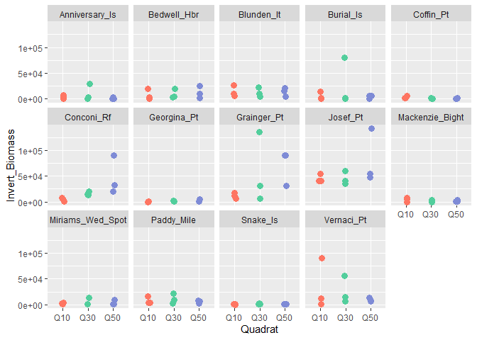
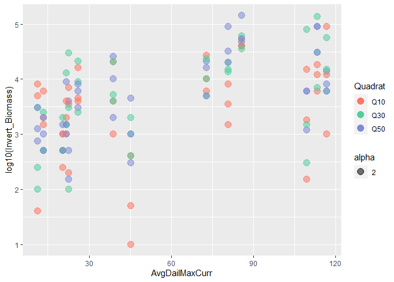

HiLo Exploratory Analysis
================
Fiona Francis
2/8/2021

This analysis is for Sharon Jeffrey and is part of an overall project
looking at the effect of current speed on fish and invertebrate
communities at different sites in the Straight of Georgia. Jillian
Campbell’s MSc analysis was also a component of this project.

Sharon is interested in using a mixed-effects model to look at how
different factors including site current speed, depth and substrate type
affect invert biomass and invert % cover.

The study uses 14 sites, 7 “high” current sites and 7 “low” current
sites. At each site Sharon collected invert data in 9 quadrats that are
seperated into 3 depths (10, 30 and 50 ft depth). There is no repeat
sampling so there are a total of 126 data points (14sites\*9quadrats).
However, because there are multiple collections at each site, a mixed
effects model is necessary to account for replciation at the site level.
I don’t think that we need to nest transect within site because I think
that each transect was at 1 depth (need to confirm this with Sharon) and
so depth is already being included as a fixed effect and accounting for
this replication (We need to worry about transect if they were run
perpendicular to shore (i.e. from 10 to 50 m)).

For substrate, substrate 1 is \>60% of quadrat and the codes are as
follows: Substrate Codes: 1=Bedrock Smooth, 2=Bedrock w crevices,
3=Boulders, 4=Cobble, 5=Gravel, 6=Pea Gravel, 7=Sand, 9=Mud,
0=Wood/Bark, 10=Crushed Shell, 11=Whole/Chunk Shell

## Looking at response data distributions

<!-- --><!-- --><!-- --><!-- -->

## Data visualization for biomass

Hi vs Lo

<!-- -->

Hi vs Lo (Log10 Biomass)

<!-- -->

Biomass at each quad depth overall

<!-- -->

Biomass at quad depth by site

<!-- -->

Biomass at quad depth by site coloured by Hi Lo

<!-- -->

## Plots of biomass vs current speed

Biomass vs current speed coloured by hi lo

<!-- -->

Log10Biomass vs current speed coloured by hi lo

<!-- -->

Biomass vs current speed coloured by quadrat

<!-- -->

Biomass vs rock cover

<!-- -->

Biomass vs Slope

<!-- -->

Plot of fixed effects against each other

Avg rock and slope are at the site level
<!-- --><!-- --><!-- -->
\#\# mixed-effect models

``` r
head(all.data)
```

    ## # A tibble: 6 x 24
    ##   Date  Site  HiLo  Transect Quadrat QuadName Diver_invert Diver_algae
    ##   <chr> <chr> <chr> <chr>    <chr>   <chr>    <chr>        <chr>      
    ## 1 26-J~ Buri~ Hi    T1       Q10     Burial_~ sharon       candice    
    ## 2 26-J~ Buri~ Hi    T1       Q30     Burial_~ sharon       candice    
    ## 3 26-J~ Buri~ Hi    T1       Q50     Burial_~ sharon       candice    
    ## 4 26-J~ Buri~ Hi    T2       Q30     Burial_~ candice      sharon     
    ## 5 26-J~ Buri~ Hi    T2       Q50     Burial_~ candice      sharon     
    ## 6 27-J~ Buri~ Hi    T2       Q10     Burial_~ candice      sharon     
    ## # ... with 16 more variables: Invert_percent <dbl>, Invert_Biomass <dbl>,
    ## #   DominantSp_1 <chr>, DominantSp_2 <chr>, substrate_1 <dbl>,
    ## #   substrate_1cov <dbl>, substrate2 <dbl>, substrate2cov <dbl>,
    ## #   substrate3 <dbl>, substrate3cov <dbl>, Comments <chr>, site_length_m <dbl>,
    ## #   SlopeAngle <dbl>, AvgDailMaxCurr <dbl>, InvertSpRichness <dbl>,
    ## #   AvgRkCov <dbl>

``` r
glimpse(all.data)
```

    ## Rows: 126
    ## Columns: 24
    ## $ Date             <chr> "26-Jun", "26-Jun", "26-Jun", "26-Jun", "26-Jun", ...
    ## $ Site             <chr> "Burial_Is", "Burial_Is", "Burial_Is", "Burial_Is"...
    ## $ HiLo             <chr> "Hi", "Hi", "Hi", "Hi", "Hi", "Hi", "Hi", "Hi", "H...
    ## $ Transect         <chr> "T1", "T1", "T1", "T2", "T2", "T2", "T3", "T3", "T...
    ## $ Quadrat          <chr> "Q10", "Q30", "Q50", "Q30", "Q50", "Q10", "Q10", "...
    ## $ QuadName         <chr> "Burial_Is_T1Q10", "Burial_Is_T1Q30", "Burial_Is_T...
    ## $ Diver_invert     <chr> "sharon", "sharon", "sharon", "candice", "candice"...
    ## $ Diver_algae      <chr> "candice", "candice", "candice", "sharon", "sharon...
    ## $ Invert_percent   <dbl> 30, 80, 30, 10, 60, 30, 15, 30, 60, 90, 90, 60, 80...
    ## $ Invert_Biomass   <dbl> 15000, 80000, 6000, 300, 1200, 1800, 150, 1500, 60...
    ## $ DominantSp_1     <chr> NA, "Metridium farcimen", NA, NA, NA, NA, NA, NA, ...
    ## $ DominantSp_2     <chr> NA, "Dodecaceria fewksi", NA, NA, NA, NA, NA, NA, ...
    ## $ substrate_1      <dbl> 2, 1, 5, 2, 2, 2, 2, 2, 2, 3, 1, 3, 3, 1, 1, 1, 2,...
    ## $ substrate_1cov   <dbl> 80, 50, 70, 100, 100, 100, 100, 100, 100, 90, 80, ...
    ## $ substrate2       <dbl> 10, 2, 4, NA, NA, NA, NA, NA, NA, 10, 10, 10, 10, ...
    ## $ substrate2cov    <dbl> 20, 50, 20, NA, NA, NA, NA, NA, NA, 10, 10, 20, 20...
    ## $ substrate3       <dbl> NA, NA, 7, NA, NA, NA, NA, NA, NA, NA, 2, NA, NA, ...
    ## $ substrate3cov    <dbl> NA, NA, 10, NA, NA, NA, NA, NA, NA, NA, 10, NA, NA...
    ## $ Comments         <chr> NA, NA, NA, NA, NA, NA, NA, NA, NA, NA, "invert % ...
    ## $ site_length_m    <dbl> 77.704, 77.704, 77.704, 77.704, 77.704, 77.704, 77...
    ## $ SlopeAngle       <dbl> 8.9, 8.9, 8.9, 8.9, 8.9, 8.9, 8.9, 8.9, 8.9, 14.1,...
    ## $ AvgDailMaxCurr   <dbl> 109.4, 109.4, 109.4, 109.4, 109.4, 109.4, 109.4, 1...
    ## $ InvertSpRichness <dbl> 20.6, 20.6, 20.6, 20.6, 20.6, 20.6, 20.6, 20.6, 20...
    ## $ AvgRkCov         <dbl> 88.9, 88.9, 88.9, 88.9, 88.9, 88.9, 88.9, 88.9, 88...

``` r
# using max current speed, fitting a random effect for site
# need to specify using ML instead of REML. Here is the logic from talking to Dave Iles a statistician at Environment Canada. "I think this is happening because restricted maximum likelihood (REML) is being used to fit the models, rather than ML.  Annoyingly, REML is the default method for fitting mixed-effect models in both the lme4 and nlme packages - and ML needs to be explicitly specified to fit and compare models with the same random effect structure but different fixed effects."

#single variable
Null <- lme(log10(Invert_Biomass) ~ 1, 
            random = ~ 1 | Site, data = all.data, method = "ML")

Lm1 <-  lme(log10(Invert_Biomass) ~ HiLo, 
            random = ~ 1 | Site, data = all.data, method = "ML")

Lm2  <- lme(log10(Invert_Biomass) ~ Quadrat, 
            random = ~ 1 | Site, data = all.data, method = "ML")

Lm3 <- lme(log10(Invert_Biomass) ~ SlopeAngle, 
            random = ~ 1 | Site, data = all.data, method = "ML")

Lm4 <-  lme(log10(Invert_Biomass) ~ AvgRkCov,
            random = ~ 1 | Site, data = all.data, method = "ML")

Lm5 <-  lme(log10(Invert_Biomass) ~ AvgDailMaxCurr, 
            random = ~ 1 | Site, data = all.data, method = "ML")


#two variables
Lm6 <- lme(log10(Invert_Biomass) ~ AvgDailMaxCurr + Quadrat, 
            random = ~ 1 | Site, data = all.data, method = "ML")

Lm7 <- lme(log10(Invert_Biomass) ~ AvgDailMaxCurr + SlopeAngle, 
            random = ~ 1 | Site, data = all.data, method = "ML")

Lm8 <- lme(log10(Invert_Biomass) ~ AvgDailMaxCurr + AvgRkCov, 
            random = ~ 1 | Site, data = all.data, method = "ML")

Lm9 <- lme(log10(Invert_Biomass) ~ Quadrat + SlopeAngle, 
            random = ~ 1 | Site, data = all.data, method = "ML")

Lm10 <- lme(log10(Invert_Biomass) ~ Quadrat + AvgRkCov, 
            random = ~ 1 | Site, data = all.data, method = "ML")

Lm11 <-  lme(log10(Invert_Biomass) ~ SlopeAngle + AvgRkCov, 
            random = ~ 1 | Site, data = all.data, method = "ML")

#three variables

Lm12 <- lme(log10(Invert_Biomass) ~ AvgDailMaxCurr + Quadrat, 
            random = ~ 1 | Site, data = all.data, method = "ML")

Lm13 <- lme(log10(Invert_Biomass) ~ AvgDailMaxCurr + Quadrat + SlopeAngle, 
            random = ~ 1 | Site, data = all.data, method = "ML")

Lm14 <- lme(log10(Invert_Biomass) ~ AvgDailMaxCurr + Quadrat + AvgRkCov, 
            random = ~ 1 | Site, data = all.data, method = "ML")

Lm15 <- lme(log10(Invert_Biomass) ~ AvgDailMaxCurr + SlopeAngle + AvgRkCov, 
            random = ~ 1 | Site, data = all.data, method = "ML")

Lm16 <- lme(log10(Invert_Biomass) ~ Quadrat + SlopeAngle + AvgRkCov, 
            random = ~ 1 | Site, data = all.data, method = "ML")

# four variables

Lm17 <- lme(log10(Invert_Biomass) ~ AvgDailMaxCurr + Quadrat + SlopeAngle + AvgRkCov, 
            random = ~ 1 | Site, data = all.data, method = "ML")


names <- c("Null", "Current", "Depth", "Slope", "Rock", "ContCurrent")

AICtab(Null, Lm1, Lm2, Lm3, Lm4, Lm5, Lm6, Lm7, Lm8,Lm9, Lm10, Lm11, Lm12, Lm13, Lm14, Lm15, Lm16, Lm17, base=TRUE, weights=TRUE, logLik=TRUE)
```

    ##      logLik AIC    dLogLik dAIC   df weight
    ## Lm13 -114.0  242.0    8.9     0.0 7  0.2427
    ## Lm7  -116.2  242.3    6.7     0.3 5  0.2112
    ## Lm17 -113.4  242.8    9.5     0.8 8  0.1627
    ## Lm15 -115.6  243.1    7.3     1.1 6  0.1416
    ## Lm6  -116.5  244.9    6.4     2.9 6  0.0567
    ## Lm12 -116.5  244.9    6.4     2.9 6  0.0567
    ## Lm5  -118.6  245.2    4.3     3.2 4  0.0493
    ## Lm14 -116.3  246.6    6.6     4.6 7  0.0247
    ## Lm8  -118.4  246.9    4.4     4.9 5  0.0215
    ## Lm9  -118.6  249.1    4.3     7.1 6  0.0070
    ## Lm3  -120.7  249.4    2.2     7.4 4  0.0061
    ## Lm1  -120.8  249.6    2.1     7.6 4  0.0055
    ## Lm16 -118.0  249.9    4.9     7.9 7  0.0046
    ## Lm11 -120.1  250.2    2.8     8.2 5  0.0040
    ## Lm2  -120.7  251.5    2.1     9.5 5  0.0021
    ## Null -122.9  251.8    0.0     9.7 3  0.0019
    ## Lm10 -120.6  253.2    2.3    11.2 6  <0.001
    ## Lm4  -122.8  253.5    0.1    11.5 4  <0.001

``` r
Lm13 <- lme(log10(Invert_Biomass) ~ AvgDailMaxCurr + Quadrat + SlopeAngle, 
            random = ~ 1 | Site, data = all.data, method = "ML")

Lm7 <- lme(log10(Invert_Biomass) ~ AvgDailMaxCurr + SlopeAngle, 
            random = ~ 1 | Site, data = all.data, method = "ML")

Lm17 <- lme(log10(Invert_Biomass) ~ AvgDailMaxCurr + Quadrat + SlopeAngle + AvgRkCov, 
            random = ~ 1 | Site, data = all.data, method = "ML")

Lm15 <- lme(log10(Invert_Biomass) ~ AvgDailMaxCurr + SlopeAngle + AvgRkCov, 
            random = ~ 1 | Site, data = all.data, method = "ML")
```

So there are several models within 2 delta AIC units but we can see that
current and depth are in all of them so these are clearly important
variables. Let’s take a closer look at the diagnostics of the top model:

    ## Linear mixed-effects model fit by maximum likelihood
    ##   Data: all.data 
    ##   Log-likelihood: -114.0113
    ##   Fixed: log10(Invert_Biomass) ~ AvgDailMaxCurr + Quadrat + SlopeAngle 
    ##    (Intercept) AvgDailMaxCurr     QuadratQ30     QuadratQ50     SlopeAngle 
    ##    2.466370521    0.009673933    0.189729504    0.237886839    0.024794172 
    ## 
    ## Random effects:
    ##  Formula: ~1 | Site
    ##         (Intercept)  Residual
    ## StdDev:   0.3308808 0.5519688
    ## 
    ## Number of Observations: 126
    ## Number of Groups: 14

<!-- --><!-- -->
Plotting predictors seperately from Lm13 (current, depth, slope)

    ## Linear mixed-effects model fit by maximum likelihood
    ##  Data: all.data 
    ##        AIC      BIC    logLik
    ##   242.0225 261.8765 -114.0113
    ## 
    ## Random effects:
    ##  Formula: ~1 | Site
    ##         (Intercept)  Residual
    ## StdDev:   0.3308808 0.5519688
    ## 
    ## Fixed effects: log10(Invert_Biomass) ~ AvgDailMaxCurr + Quadrat + SlopeAngle 
    ##                    Value  Std.Error  DF  t-value p-value
    ## (Intercept)    2.4663705 0.25556811 110 9.650541  0.0000
    ## AvgDailMaxCurr 0.0096739 0.00275885  11 3.506509  0.0049
    ## QuadratQ30     0.1897295 0.12291290 110 1.543609  0.1256
    ## QuadratQ50     0.2378868 0.12291290 110 1.935410  0.0555
    ## SlopeAngle     0.0247942 0.01043587  11 2.375860  0.0368
    ##  Correlation: 
    ##                (Intr) AvgDMC QdrQ30 QdrQ50
    ## AvgDailMaxCurr -0.461                     
    ## QuadratQ30     -0.240  0.000              
    ## QuadratQ50     -0.240  0.000  0.500       
    ## SlopeAngle     -0.642 -0.184  0.000  0.000
    ## 
    ## Standardized Within-Group Residuals:
    ##        Min         Q1        Med         Q3        Max 
    ## -2.8945086 -0.5479547  0.0612298  0.5896900  2.3982479 
    ## 
    ## Number of Observations: 126
    ## Number of Groups: 14

Current speed
<!-- -->

Depth
<!-- -->
Slope
<!-- -->

## Invertebrate Percent Cover

# Same plots but looking at % invert cover instead of biomass

<!-- --><!-- --><!-- --><!-- -->

Cover vs current

<!-- -->

Cover vs current speed

<!-- -->

Cover vs rock cover

<!-- -->

Cover vs Slope

<!-- -->

\#Preliminary models for Percent Cover

``` r
head(all.data)
```

    ## # A tibble: 6 x 24
    ##   Date  Site  HiLo  Transect Quadrat QuadName Diver_invert Diver_algae
    ##   <chr> <chr> <chr> <chr>    <chr>   <chr>    <chr>        <chr>      
    ## 1 26-J~ Buri~ Hi    T1       Q10     Burial_~ sharon       candice    
    ## 2 26-J~ Buri~ Hi    T1       Q30     Burial_~ sharon       candice    
    ## 3 26-J~ Buri~ Hi    T1       Q50     Burial_~ sharon       candice    
    ## 4 26-J~ Buri~ Hi    T2       Q30     Burial_~ candice      sharon     
    ## 5 26-J~ Buri~ Hi    T2       Q50     Burial_~ candice      sharon     
    ## 6 27-J~ Buri~ Hi    T2       Q10     Burial_~ candice      sharon     
    ## # ... with 16 more variables: Invert_percent <dbl>, Invert_Biomass <dbl>,
    ## #   DominantSp_1 <chr>, DominantSp_2 <chr>, substrate_1 <dbl>,
    ## #   substrate_1cov <dbl>, substrate2 <dbl>, substrate2cov <dbl>,
    ## #   substrate3 <dbl>, substrate3cov <dbl>, Comments <chr>, site_length_m <dbl>,
    ## #   SlopeAngle <dbl>, AvgDailMaxCurr <dbl>, InvertSpRichness <dbl>,
    ## #   AvgRkCov <dbl>

``` r
glimpse(all.data)
```

    ## Rows: 126
    ## Columns: 24
    ## $ Date             <chr> "26-Jun", "26-Jun", "26-Jun", "26-Jun", "26-Jun", ...
    ## $ Site             <chr> "Burial_Is", "Burial_Is", "Burial_Is", "Burial_Is"...
    ## $ HiLo             <chr> "Hi", "Hi", "Hi", "Hi", "Hi", "Hi", "Hi", "Hi", "H...
    ## $ Transect         <chr> "T1", "T1", "T1", "T2", "T2", "T2", "T3", "T3", "T...
    ## $ Quadrat          <chr> "Q10", "Q30", "Q50", "Q30", "Q50", "Q10", "Q10", "...
    ## $ QuadName         <chr> "Burial_Is_T1Q10", "Burial_Is_T1Q30", "Burial_Is_T...
    ## $ Diver_invert     <chr> "sharon", "sharon", "sharon", "candice", "candice"...
    ## $ Diver_algae      <chr> "candice", "candice", "candice", "sharon", "sharon...
    ## $ Invert_percent   <dbl> 30, 80, 30, 10, 60, 30, 15, 30, 60, 90, 90, 60, 80...
    ## $ Invert_Biomass   <dbl> 15000, 80000, 6000, 300, 1200, 1800, 150, 1500, 60...
    ## $ DominantSp_1     <chr> NA, "Metridium farcimen", NA, NA, NA, NA, NA, NA, ...
    ## $ DominantSp_2     <chr> NA, "Dodecaceria fewksi", NA, NA, NA, NA, NA, NA, ...
    ## $ substrate_1      <dbl> 2, 1, 5, 2, 2, 2, 2, 2, 2, 3, 1, 3, 3, 1, 1, 1, 2,...
    ## $ substrate_1cov   <dbl> 80, 50, 70, 100, 100, 100, 100, 100, 100, 90, 80, ...
    ## $ substrate2       <dbl> 10, 2, 4, NA, NA, NA, NA, NA, NA, 10, 10, 10, 10, ...
    ## $ substrate2cov    <dbl> 20, 50, 20, NA, NA, NA, NA, NA, NA, 10, 10, 20, 20...
    ## $ substrate3       <dbl> NA, NA, 7, NA, NA, NA, NA, NA, NA, NA, 2, NA, NA, ...
    ## $ substrate3cov    <dbl> NA, NA, 10, NA, NA, NA, NA, NA, NA, NA, 10, NA, NA...
    ## $ Comments         <chr> NA, NA, NA, NA, NA, NA, NA, NA, NA, NA, "invert % ...
    ## $ site_length_m    <dbl> 77.704, 77.704, 77.704, 77.704, 77.704, 77.704, 77...
    ## $ SlopeAngle       <dbl> 8.9, 8.9, 8.9, 8.9, 8.9, 8.9, 8.9, 8.9, 8.9, 14.1,...
    ## $ AvgDailMaxCurr   <dbl> 109.4, 109.4, 109.4, 109.4, 109.4, 109.4, 109.4, 1...
    ## $ InvertSpRichness <dbl> 20.6, 20.6, 20.6, 20.6, 20.6, 20.6, 20.6, 20.6, 20...
    ## $ AvgRkCov         <dbl> 88.9, 88.9, 88.9, 88.9, 88.9, 88.9, 88.9, 88.9, 88...

``` r
# using max current speed, fitting a random effect for site
# need to specify using ML instead of REML. Here is the logic from talking to Dave Iles a statistician at Environment Canada. "I think this is happening because restricted maximum likelihood (REML) is being used to fit the models, rather than ML.  Annoyingly, REML is the default method for fitting mixed-effect models in both the lme4 and nlme packages - and ML needs to be explicitly specified to fit and compare models with the same random effect structure but different fixed effects."

#single variable
Null.per <- lme(Invert_percent ~ 1, 
            random = ~ 1 | Site, data = all.data, method = "ML")

Lm1.per <-  lme(Invert_percent ~ HiLo, 
            random = ~ 1 | Site, data = all.data, method = "ML")

Lm2.per  <- lme(Invert_percent ~ Quadrat, 
            random = ~ 1 | Site, data = all.data, method = "ML")

Lm3.per <- lme(Invert_percent ~ SlopeAngle, 
            random = ~ 1 | Site, data = all.data, method = "ML")

Lm4.per <-  lme(Invert_percent ~ AvgRkCov,
            random = ~ 1 | Site, data = all.data, method = "ML")

Lm5.per <-  lme(Invert_percent ~ AvgDailMaxCurr, 
            random = ~ 1 | Site, data = all.data, method = "ML")


#two variables
Lm6.per <- lme(Invert_percent ~ AvgDailMaxCurr + Quadrat, 
            random = ~ 1 | Site, data = all.data, method = "ML")

Lm7.per <- lme(Invert_percent ~ AvgDailMaxCurr + SlopeAngle, 
            random = ~ 1 | Site, data = all.data, method = "ML")

Lm8.per <- lme(Invert_percent ~ AvgDailMaxCurr + AvgRkCov, 
            random = ~ 1 | Site, data = all.data, method = "ML")

Lm9.per <- lme(Invert_percent ~ Quadrat + SlopeAngle, 
            random = ~ 1 | Site, data = all.data, method = "ML")

Lm10.per <- lme(Invert_percent ~ Quadrat + AvgRkCov, 
            random = ~ 1 | Site, data = all.data, method = "ML")

Lm11.per <-  lme(Invert_percent ~ SlopeAngle + AvgRkCov, 
            random = ~ 1 | Site, data = all.data, method = "ML")

#three variables

Lm12.per <- lme(Invert_percent ~ AvgDailMaxCurr + Quadrat, 
            random = ~ 1 | Site, data = all.data, method = "ML")

Lm13.per <- lme(Invert_percent ~ AvgDailMaxCurr + Quadrat + SlopeAngle, 
            random = ~ 1 | Site, data = all.data, method = "ML")

Lm14.per <- lme(Invert_percent ~ AvgDailMaxCurr + Quadrat + AvgRkCov, 
            random = ~ 1 | Site, data = all.data, method = "ML")

Lm15.per <- lme(Invert_percent ~ AvgDailMaxCurr + SlopeAngle + AvgRkCov, 
            random = ~ 1 | Site, data = all.data, method = "ML")

Lm16.per <- lme(Invert_percent ~ Quadrat + SlopeAngle + AvgRkCov, 
            random = ~ 1 | Site, data = all.data, method = "ML")

# four variables

Lm17.per <- lme(Invert_percent ~ AvgDailMaxCurr + Quadrat + SlopeAngle + AvgRkCov, 
            random = ~ 1 | Site, data = all.data, method = "ML")


names <- c("Null", "Current", "Depth", "Slope", "Rock", "ContCurrent")

AICtab(Null.per, Lm1.per, Lm2.per, Lm3.per, Lm4.per, Lm5.per, Lm6.per, Lm7.per, Lm8.per,Lm9.per, Lm10.per, Lm11.per, Lm12.per, Lm13.per, Lm14.per, Lm15.per, Lm16.per, Lm17.per, base=TRUE, weights=TRUE, logLik=TRUE)
```

    ##          logLik AIC    dLogLik dAIC   df weight
    ## Lm15.per -564.9 1141.7    4.7     0.0 6  0.2367
    ## Lm5.per  -567.5 1143.1    2.0     1.4 4  0.1188
    ## Lm11.per -566.6 1143.2    2.9     1.5 5  0.1094
    ## Lm7.per  -566.7 1143.5    2.8     1.7 5  0.0989
    ## Lm17.per -564.2 1144.4    5.3     2.7 8  0.0609
    ## Lm1.per  -568.3 1144.6    1.2     2.9 4  0.0555
    ## Lm8.per  -567.4 1144.8    2.1     3.1 5  0.0511
    ## Lm3.per  -568.4 1144.9    1.1     3.2 4  0.0481
    ## Null.per -569.5 1145.0    0.0     3.3 3  0.0454
    ## Lm6.per  -566.9 1145.8    2.6     4.1 6  0.0306
    ## Lm12.per -566.9 1145.8    2.6     4.1 6  0.0306
    ## Lm16.per -566.0 1146.0    3.5     4.3 7  0.0282
    ## Lm13.per -566.1 1146.2    3.4     4.5 7  0.0255
    ## Lm4.per  -569.4 1146.8    0.1     5.1 4  0.0184
    ## Lm14.per -566.7 1147.5    2.8     5.8 7  0.0131
    ## Lm9.per  -567.8 1147.6    1.7     5.9 6  0.0124
    ## Lm2.per  -568.9 1147.7    0.6     6.0 5  0.0117
    ## Lm10.per -568.8 1149.5    0.7     7.8 6  0.0047

``` r
Lm15.per
```

    ## Linear mixed-effects model fit by maximum likelihood
    ##   Data: all.data 
    ##   Log-likelihood: -564.8529
    ##   Fixed: Invert_percent ~ AvgDailMaxCurr + SlopeAngle + AvgRkCov 
    ##    (Intercept) AvgDailMaxCurr     SlopeAngle       AvgRkCov 
    ##    169.9913478      0.1921314      1.1406753     -1.7527602 
    ## 
    ## Random effects:
    ##  Formula: ~1 | Site
    ##         (Intercept) Residual
    ## StdDev:     11.5606 19.80831
    ## 
    ## Number of Observations: 126
    ## Number of Groups: 14

``` r
plot(Lm15.per)
```

<!-- -->

``` r
qqnorm(resid(Lm15.per))
```

<!-- -->
